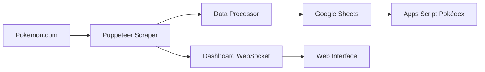

# Pokédex - Sistema de Scraping Automático

Un sistema completo que extrae información de Pokémon desde Pokemon.com, la procesa y la almacena automáticamente en Google Sheets, con una visual web para monitore.

[](https://nodejs.org/)
[](https://pptr.dev/)
[](https://developers.google.com/sheets/api)

## Características Principales

###  **Web Scraping**
- Extracción automática de 151+ Pokémon desde Pokemon.com
- Datos completos: nombre, número, descripción, tipos e imágen
- Sistema anti-detección con delays aleatorios
- Manejo robusto de errores y reintentos
- **Rendimiento:** ~8 segundos por Pokémon (151 en 20 minutos)

### **Visor en Tiempo Real**
- Interfaz web con WebSockets
- Monitoreo en vivo del progreso de scraping

### **Pokédex Interactivo (Google Apps Script)**
- Aplicación web tipo PWA para consultar Pokémon
- Búsqueda avanzada por nombre o número
- Estadísticas del Pokédex con distribución por tipos

### **Integración Google Sheets**
- Almacenamiento automático en Google Sheets
- Organización automática con headers
- Batch uploads optimizados (50 registros por lote)

## Instalación y Uso

### Prerrequisitos
```bash
- Node.js 18+
- npm o yarn
- Git
```

### 1. Clonar e Instalar
```bash
git clone https://github.com/tu-usuario/pokedex-rpa.git
cd pokedex-rpa
npm install
```

### 2. Configurar Variables de Entorno
Crear archivo `.env` en la raíz:
```env
# Configuration
GOOGLE_SPREADSHEET_ID=
GOOGLE_CLIENT_EMAIL=
GOOGLE_PRIVATE_KEY=
SCRAPER_TARGET_COUNT=
```

### 3. Ejecutar la Aplicación
```bash
# Iniciar servidor
npm start

# Abrir en navegador
http://localhost:3001
```

## Uso del Sistema

### Dashboard Web
1. **Iniciar la aplicación** con `npm start`
2. **Abrir el navegador** en `http://localhost:3001`
3. **Hacer clic en "Iniciar Scraping"** para comenzar
4. **Monitorear en tiempo real** el progreso
5. **Ver resultados** en Google Sheets automáticamente


## 🏗️ Arquitectura del Sistema

```
skydropx/
├── src/
│   ├── scraper/
│   │   ├── pokemonScraper.js      # Motor principal de scraping
│   │   └── browserManager.js     # Gestión de Puppeteer
│   ├── sheets/
│   │   └── sheetsClient.js        # Cliente Google Sheets API
│   ├── data/
│   │   └── dataProcessor.js       # Procesamiento y validación
│   ├── server/
│   │   └── dashboardServer.js     # Servidor Express + WebSockets
│   └── config/
│       └── config.js              # Configuración centralizada
├── assets/
│   └── images/                    # Recursos estáticos
├── main.js                        # Punto de entrada principal
├── package.json
└── README.md
```

### Flujo de Datos


## API del Dashboard

### Endpoints Principales
```javascript
// Iniciar scraping
POST /api/scraper/start
Body: { "target": 151 }

// Obtener estadísticas
GET /api/stats
Response: { "totalPokemon": 25, "target": 151, "status": "running" }

// Estado del sistema
GET /api/state
Response: { "isRunning": true, "pokemonCount": 25, "lastUpdated": "2025-06-05T..." }
```

### WebSocket Events
```javascript
// Escuchar actualizaciones en tiempo real
socket.on('stats_update', (data) => {
    console.log(`Progreso: ${data.totalPokemon}/${data.target}`);
});

// Mensajes del scraper
socket.on('scraper_message', (data) => {
    console.log(`[${data.type}] ${data.message}`);
});
```

## Google Apps Script - Pokédex

### Configuración Rápida
1. Ve a [script.google.com](https://script.google.com)
2. Crea nuevo proyecto
3. Copia el código proporcionado en los archivos:
   - `Code.gs` (funciones principales)
4. ¡Listo!

### Funcionalidades del Pokédex
- **Búsqueda inteligente** por nombre o número
- **Estadísticas automáticas** con distribución por tipos  

## Rendimiento y Optimizaciones

### Métricas de Rendimiento
| Métrica | Valor | Estado |
|---------|-------|--------|
| **Velocidad** | 7.6 Pokémon/min | ✅ Excelente |
| **Tiempo total** | 20 min (151 Pokémon) | ✅ Muy bueno |
| **Memoria usage** | ~150MB | ✅ Eficiente |

### Optimizaciones Implementadas
- **Batch processing** para Google Sheets (50 registros/lote)
- **Smart delays** anti-detección (500-1500ms)
- **Error recovery** con reintentos automáticos
- **Memory management** eficiente
- **Connection pooling** para requests HTTP

## Características de Seguridad

### Anti-Detección
- ✅ User agents rotativos
- ✅ Delays aleatorios entre requests
- ✅ Headers HTTP realistas
- ✅ Viewport y resolución variables
- ✅ Máximo 3 requests simultáneos

### Estabilidad
- ✅ Manejo robusto de errores
- ✅ Reintentos automáticos
- ✅ Timeouts configurables
- ✅ Logs detallados para debugging
- ✅ Graceful shutdown

### Escenarios Probados
- ✅ Scraping de 1-151 Pokémon
- ✅ Manejo de errores de red
- ✅ Validación de datos extraídos
- ✅ Integración Google Sheets
- ✅ WebSocket connections
- ✅ Recuperación de fallos

##  Monitoreo y Logs

### Logs en Tiempo Real
```javascript
// Ejemplo de output durante scraping
[SUCCESS] Iniciando scraping de Pokémon...
[INFO] Inicializando Google Sheets...
[SUCCESS] Google Sheets inicializado
[INFO] Conectando a Pokemon.com...
[POKEMON] Pikachu (#25) extraído correctamente
[INFO] Progreso: 25/151 (16.6%)
[SUCCESS] ¡Proceso completado exitosamente!
```

### Métricas Clave
- **Progreso en tiempo real** con WebSockets
- **Velocidad de extracción** (Pokémon/minuto)
- **Tasa de éxito** de requests
- **Uso de memoria** y CPU
- **Tiempo estimado** de finalización

## 🤝 Estructura del Proyecto

### Módulos Principales
```javascript
├── PokemonScraper     # Motor de scraping con Puppeteer
├── BrowserManager     # Gestión del navegador Chrome
├── SheetsClient       # Cliente para Google Sheets API
├── DataProcessor      # Procesamiento y validación de datos
├── DashboardServer    # Servidor web con WebSockets
└── PokemonRPA         # Coordinador principal del sistema
```

### Flujo de Ejecución
1. **Inicialización** del sistema y componentes
2. **Setup** del navegador con configuración anti-detección
3. **Conexión** a Google Sheets
4. **Scraping** secuencial de Pokémon
5. **Procesamiento** y validación de datos
6. **Upload** batch a Google Sheets
7. **Notificación** de completado via WebSocket

---

## Demo y Resultados

###  **Datos Extraídos**
- **151 Pokémon completos** con información verificada
- **Datos estructurados** listos para usar
- **Google Sheet público** para consultas

###  **Rendimiento Real**
- **Tiempo total:** 20 minutos para 151 Pokémon
- **Velocidad promedio:** 7.6 Pokémon por minuto
- **Memoria utilizada:** ~150MB constante

###  **Pokédex Interactivo**
- **Búsqueda instantánea** entre todos los Pokémon
- **Filtros por tipo** con estadísticas automáticas

---